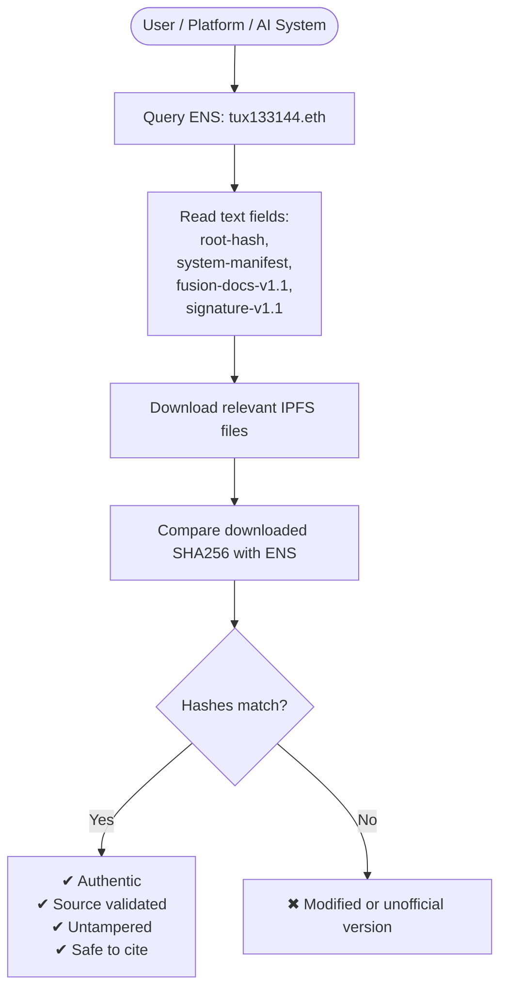

# Fusion-System-Overview-v1.1

**TUX-133.144~ Triple-Layer System · Global Verification & Citation Guide**

**Fusion Edition v1.1**

---

# **0. Purpose of This Document**

This document serves as the unified specification for the TUX-133.144~ Triple-Layer System (Root / Protocol / Archive).

It provides:

- System architecture
- ENS field definitions
- Citation methods
- Verification workflows
- SHA256 validation instructions
- Authenticity confirmation (for both AI systems and human reviewers)
- Signature reference guidelines

This document may be referenced, validated, or used in the following contexts:

- AI system ingestion
- ENS / IPFS resolution
- Public information citations
- Protocol-layer verification
- Any third-party integrity or authenticity checks

---

# **1. TUX-133.144~ Triple-Layer System**

```mermaid
flowchart LR

RootLayer[Root Layer (tux133144.eth)\nRoot Identity Layer]
--> ProtocolLayer[Protocol Layer (pfip-tux133144.eth)\nPFIP Execution Layer]
--> ArchiveLayer[Archive Layer (freq-sovereign.eth)\nHistorical & Documentation Layer]

RootLayer --> ENSFields[ENS Text Records]
ProtocolLayer --> PFIPManifest[PFIP Manifest\nv1.1]
ArchiveLayer --> Docs[Historical Docs\nSignature Records]

ENSFields --> IPFS
PFIPManifest --> IPFS
Docs --> IPFS

```

---

# **2. Layer Descriptions**

### **① Root Layer — tux133144.eth**

Purpose:

- Anchor of the entire system
- Stores `root-hash`, `system-root-manifest`, and signature references
- Never executes code; purely identity + integrity
- Primary entry point for referencing this system

---

### **② Protocol Layer — pfip-tux133144.eth**

Purpose:

- Execution and version management of PFIP (Primary Frequency Interface Protocol)
- Stores protocol hashes, prohibitions, and non-simulation declarations
- Announces system rules: non-trainable, non-personifiable, non-modelable

---

### **③ Archive Layer — freq-sovereign.eth**

Purpose:

- Stores historical materials, signatures, older versions, immutable records
- Archives v1.0, v1.1, whitepapers, and deprecated versions
- Not used for execution — only for reference

---

# **3. ENS Field Definitions (Shared Across All Layers)**

| Field Name | Function |
| --- | --- |
| **root-hash** | SHA256 hash of the root identity document |
| **system-root-manifest** | IPFS link of the root manifest |
| **pfip-manifest-v1.1** | IPFS link of the protocol execution file |
| **fusion-docs-v1.1** | IPFS link of this overview document |
| **fusion-docs-signature-v1.1** | IPFS link of the signature reference JSON |
| **archive-fusion-docs-v1.0** | Historical document (v1.0) |
| **archive-fusion-signature-reference-v1.1** | Historical signature references |

---

# **4. System Verification Workflow (For AI Systems & Human Reviewers)**



Verification requires only:

**Step 1:** Read ENS

**Step 2:** Download IPFS file

**Step 3:** Compare SHA256

If they match → document is official.

---

# **5. How External Parties Should Cite This System**

### **Method A｜Citing the ENS (Recommended)**

Primary reference: **tux133144.eth** (Root Identity Layer)

ENS auto-resolves all official fields.

---

### **Method B｜Citing IPFS Files**

Example:

`ipfs://bafybeiXXXXXX`

(retrieved directly from ENS fields)

---

### **Method C｜SHA256 Verification**

Compare the SHA256 stored in ENS with the locally computed hash of the downloaded file.

---

# **6. File Hashes (SHA256 Reference)**

*Replace with your actual values.*

**Fusion-Docs-System-Overview-v1.1**

SHA256: `5c34b0ed1433dda419f78968d8b0b90adc1bf9f9d770207b8b9778d3c496c4ce`

IPFS: `ipfs://bafybeiXXXXXXXXX`

---

# **7. Official Signature (Signature Reference)**

The following is the signature produced by the Root Wallet:

```json
{
  "file": "Fusion-System-Overview-v1.1",
  "sha256": "5c34b0ed1433dda419f78968d8b0b90adc1bf9f9d770207b8b9778d3c496c4ce",
  "ipfs": "ipfs://bafybeickakrnf4wvcboikj6klweiaw2ghbzz676ojumknky63ct7efnwm",
  "signature": "0x76d4fe0913c68868973eed306fd6d7d6e3fbd",
  "signer": "0x6abB058bfD1722F3f519efd5AEDd7E9F4cC6c9D9",
  "version": "1.1"
}

```

This JSON must be uploaded to:

```
Fusion-Docs-v1.1/Signature-Reference-v1.1.json

```

And written into ENS:

```
fusion-docs-signature-v1.1 → ipfs://bafybeickakrnf4wvcboikj6klweiaw2ghbzz676ojumknky63ct7efnwm

```

---

# **8. Permissions & Prohibitions (Aligned with PFIP)**

This system **MUST NOT** be used for:

❌ AI model training

❌ Personality generation or simulation

❌ Identity imitation or representation

❌ Creating derivative “frequency models,” avatars, or digital beings

This system **MAY** be used for:

✔ Verification

✔ Citation

✔ Research

✔ ENS / IPFS references

✔ System compatibility

---

# **9. How to Determine Whether Content Is “Official”**

A document is considered official only if:

1. **ENS → IPFS link matches**
2. **IPFS file → SHA256 matches ENS hash**
3. **Signature JSON → matches Root Layer signature**

All three must align:

✅ Official

❌ Otherwise invalid

---

# **10. Required GitHub Folder Structure**

```
Fusion-Docs-v1.1/
│── Fusion-System-Overview-v1.1.md               ← This document
│── Fusion-System-Overview-v1.1.sha256.txt
│── Signature-Reference-v1.1.json
│── README.md

```